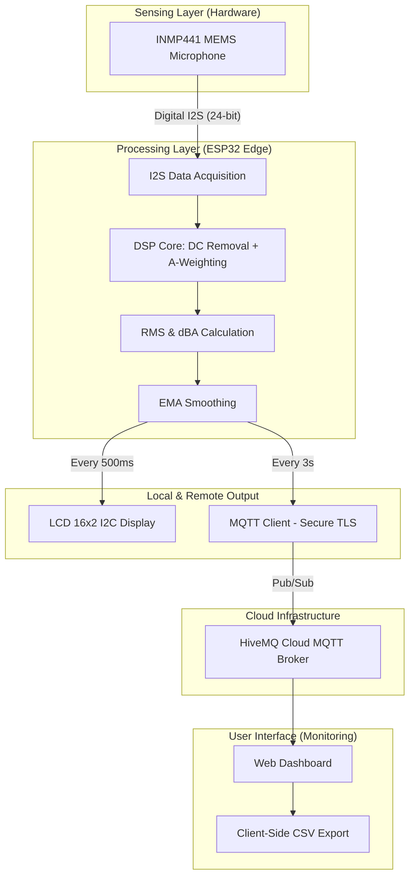
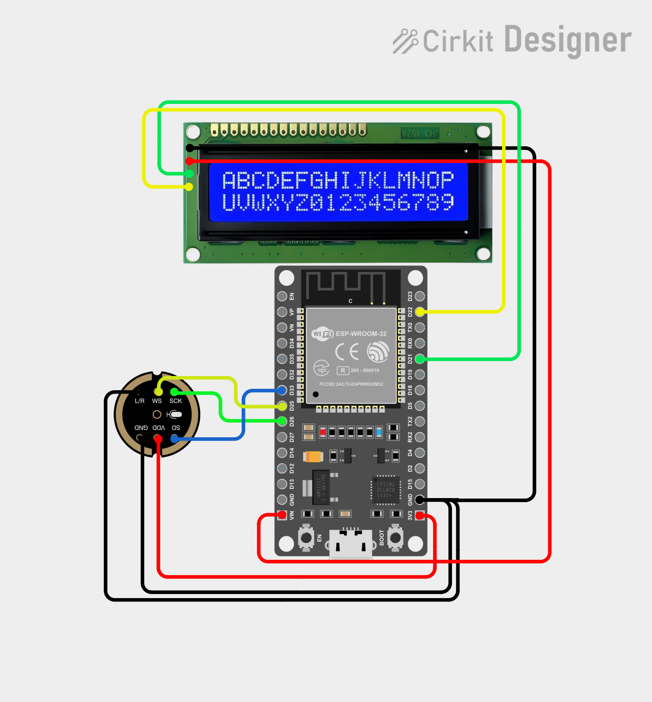

# AcousticLevel
**An IoT-Based Distributed Sound Pressure Level Monitoring System**

[](LICENSE)


---

## Overview

AcousticLevel is a low-cost, professional-grade IoT system for real-time sound pressure level (SPL) monitoring across distributed locations. Originally developed during an internship at PT Angkasa Pura Indonesia to address PA system noise issues, this system combines edge computing on an ESP32 with cloud connectivity via MQTT, enabling autonomous, scalable acoustic monitoring without expensive backend infrastructure.

### 🎯 Key Features
- **Real-time dBA Monitoring**: Professional A-weighted measurements with 125ms fast response time
- **Edge DSP Processing**: On-device filtering (DC removal, A-weighting biquad, EMA smoothing)
- **Cloud Integration**: Secure MQTT/TLS to HiveMQ Cloud for data persistence
- **Browser-Based Dashboard**: Client-side visualization with WebSocket real-time updates
- **Low-Cost BOM**: ~$50-100 for a fully functional monitoring unit
- **Local & Remote Display**: 16x2 I2C LCD + web dashboard
- **Non-Blocking Architecture**: Simultaneous audio processing, display updates, and network telemetry

---

## Table of Contents
- [Quick Start](#quick-start)
- [System Architecture](#system-architecture)
- [Hardware Setup](#hardware-setup)
  - [Pinout Configuration](#pinout-configuration)
- [Installation & Configuration](#installation--configuration)
  - [Prerequisites](#prerequisites)
  - [Firmware Setup](#firmware-setup)
  - [WiFi & MQTT Configuration](#wifi--mqtt-configuration)
  - [Calibration](#calibration)
- [Firmware Logics/DSP Pipeline](#firmware-logicsdsp-pipeline)
- [Web Dashboard](#web-dashboard)
- [Bill of Materials](#bill-of-materials)
- [Troubleshooting](#troubleshooting)
- [License](#license)

---

## Quick Start

Get AcousticLevel running in 5 minutes:

1. **Assemble Hardware**
   - Wire INMP441 microphone to ESP32 (see [Pinout Configuration](#pinout-configuration))
   - Connect 16x2 I2C LCD display
   - Power ESP32 via USB or 5V supply

2. **Install Firmware**
   ```bash
   git clone https://github.com/alfonsomzrtt/acoustic-level-monitoring.git
   cd acoustic-level-monitoring
   # Open firmware/main.ino in Arduino IDE
   # Select "ESP32 DevKit V1" board and upload
   ```

3. **Configure WiFi & MQTT**
   - Edit `config.h` with your WiFi SSID, password, and HiveMQ broker credentials
   - Device will auto-connect on boot

4. **Access Dashboard**
   - Local LCD display shows dBA readings every 500ms
   - Visit your HiveMQ Cloud dashboard to view historical data
   - Web dashboard available at `web/dashboard.html` (open in browser)

5. **Verify Operation**
   - Check LCD displays changing dBA values
   - Confirm MQTT publish status in HiveMQ console

---

## System Architecture



### Layer Breakdown

- **Sensing Layer**: INMP441 I2S MEMS Microphone
  - Captures sound waves at 16 kHz sample rate
  - Delivers pure I2S digital stream (24-bit valid data)
  - Minimal power consumption (~1mA)

- **Processing Layer (ESP32)**
  - **I2S Peripheral**: Fetches raw 32-bit audio frames via DMA (non-blocking)
  - **DSP Core**: Applies per-sample processing:
    - DC Offset Removal (IIR high-pass filter)
    - A-Weighting (2nd-order Biquad filter mimicking human hearing)
    - RMS Calculation (125ms window = "Fast" response per IEC 61672-1)
    - dBFS to dBA Conversion using calibrated offset
    - EMA Smoothing (reduces flickering)
  - **Dual Interval Logic**: 
    - Local updates at 500ms
    - Cloud telemetry every 3s (bandwidth optimization)

- **Output Layer**
  - **Local Display**: 16x2 LCD I2C (independent operation if WiFi down)
  - **Remote Transmission**: HiveMQ Cloud MQTT broker with TLS + ACL
  - **Web Dashboard**: Real-time client-side visualization via WebSocket

---

## Hardware Setup

### Pinout Configuration

<p align="center">
    
    <br>
    <em>Pinout Configuration with ESP32 DevKit V1 board</em>
    <br>
    <em>source: https://cirkitdesigner.com/</em>
</p>

The system operates in **I2S Standard Mode (Philips)**, enabling direct 24-bit digital streaming from the INMP441 to the ESP32's DMA buffer.

#### INMP441 Microphone

| INMP441 Pin | ESP32 Pin | Function | Description |
| :--- | :--- | :--- | :--- |
| **VDD** | 3V3 | Power | Power supply (1.62V - 3.63V) |
| **GND** | GND | Ground | Common system ground |
| **L/R** | GND | Channel Select | Pulled to GND for Left Channel acquisition |
| **WS** | GPIO 25 | Word Select | I2S Word/Slot select line |
| **SCK** | GPIO 26 | Bit Clock | I2S Serial Clock line |
| **SD** | GPIO 33 | Serial Data | I2S Digital Data output |

> **Note:** The **MCLK (Master Clock)** line is not required for this implementation, as the INMP441 generates its internal timing from the SCK line.

#### LCD 16x2 I2C Display

| LCD I2C Pin | ESP32 Pin | Function | Description |
| :--- | :--- | :--- | :--- |
| **VDD** | VIN | Power | 5V recommended for contrast |
| **GND** | GND | Ground | Common Ground |
| **SDA** | GPIO 21 | Serial Data | I2C Serial Data Line |
| **SCL** | GPIO 22 | Serial Clock | I2C Serial Clock Line |

> **⚠️ Important:** LCD requires stable 5V for optimal contrast; INMP441 must use 3.3V per datasheet. Use separate voltage regulators if needed.

---

## Installation & Configuration

### Prerequisites

- **Hardware**
  - ESP32 DevKit V1
  - INMP441 MEMS I2S Microphone
  - 16x2 I2C LCD Display
  - Jumper wires
  - USB cable for programming
  - 5V power supply (recommended)

- **Software**
  - Arduino IDE 2.0+
  - ESP32 Board Package (via Board Manager)
  - Required Libraries:
    - `driver/i2s.h` (ESP32 native)
    - `Wire.h` (I2C, native)
    - `PubSubClient.h` (MQTT)
    - `LiquidCrystal_I2C.h` (LCD control)

### Firmware Setup

1. **Install Arduino IDE & ESP32 Support**
   ```
   Arduino IDE → Preferences → Board Manager URLs
   Add: https://dl.espressif.com/dl/package_esp32_index.json
   Tools → Board Manager → Search "esp32" → Install
   ```

2. **Install Required Libraries**
   ```
   Sketch → Include Library → Manage Libraries
   Search and install:
   - PubSubClient (by Nick O'Leary)
   - LiquidCrystal_I2C (by Frank de Brabander)
   ```

3. **Clone Repository**
   ```bash
   git clone https://github.com/alfonsomzrtt/acoustic-level-monitoring.git
   cd acoustic-level-monitoring
   ```

4. **Configure & Upload**
   - Open `firmware/main.ino` in Arduino IDE
   - Select Board: `ESP32 Dev Module`
   - Select Port: (your USB COM port)
   - Click Upload

### WiFi & MQTT Configuration

Edit `firmware/config.h` with your credentials:

```cpp
// WiFi
const char* ssid = "YOUR_SSID";
const char* password = "YOUR_PASSWORD";

// HiveMQ Cloud MQTT
const char* mqtt_server = "your-broker.hivemq.cloud";
const int mqtt_port = 8883;  // TLS port
const char* mqtt_user = "your_username";
const char* mqtt_password = "your_password";
const char* mqtt_topic_publish = "acoustic/sensor/dba";
```

**Setting up HiveMQ Cloud:**
1. Create free account at [hivemq.cloud](https://www.hivemq.cloud)
2. Create new cluster (choose EU or US region)
3. Copy broker address, generate credentials in Access Management
4. Enable TLS (port 8883) for secure connections
5. Configure ACL for your username to publish to `acoustic/sensor/+`

### Calibration

For accurate SPL readings:

1. **Reference Calibration**
   - Use a calibrated SPL meter (phone app or professional device)
   - Place both devices in same location
   - Measure reference dB value from both devices
   - Calculate offset: `offset = reference_dB - reported_dB`

2. **Apply Calibration**
   - Edit `firmware/config.h`:
     ```cpp
     const float SPL_OFFSET = 0.0;  // Adjust this value
     ```
   - Recompile and upload

3. **Typical Reference Points** (quiet room ~35dB, normal speech ~60dB, loud music ~85dB)

---

## Firmware Logics/DSP Pipeline


### Pipeline Breakdown

- **Data Extraction**: INMP441 transmits 32-bit packets; only 24 bits contain valid audio. System uses bit-shifting to extract the 24-bit payload before DSP routing.

- **DSP Core (Per-Sample Processing)**
  - **DC Offset Removal (IIR Filter)**: Eliminates hardware-induced DC bias, centering the audio waveform at zero
  - **A-Weighting (2nd Order Biquad)**: Applies frequency response curve mimicking human hearing—dampening extreme highs/lows, emphasizing vocal ranges (500Hz–4kHz)
  - **RMS Calculation**: Computes Root Mean Square over precise 125ms window (standard "Fast" response per IEC 61672-1)
  - **dBFS to dBA Conversion**: Translates internal dBFS (Decibels relative to full scale) into real-world dBA using calibrated offset
  - **EMA Smoothing**: Exponential Moving Average smooths final dBA reading, preventing UI flicker

- **Asynchronous Output Logic**: Non-blocking interval checks allow simultaneous audio processing, display updates, and network operations
  - **Local UI (500ms)**: LCD refreshes 2× per second for responsive local monitoring
  - **Cloud Telemetry (3s)**: JSON payload published to HiveMQ every 3 seconds (significant bandwidth/quota savings without losing temporal resolution)

**Firmware Performance:**
- Audio processing: < 1ms per frame
- ESP32 CPU load: ~15–20% (efficient FPU use)
- Memory usage: ~12KB RAM

---

## Web Dashboard

The web dashboard provides real-time visualization of acoustic data.

**Features:**
- Live dBA chart with auto-scaling
- Historical data display (last 24 hours)
- CSV export functionality
- Real-time WebSocket updates from HiveMQ
- Client-side rendering (no server required)

**Files:**
- `web/dashboard.html` - Main dashboard interface
- `web/overview.html` - Summary view

**Usage:**
1. Open `web/dashboard.html` in any modern browser
2. Enter your HiveMQ broker details when prompted
3. Dashboard auto-connects via WebSocket
4. View live and historical dBA trends
5. Export data as CSV for analysis

---

## Bill of Materials

| Component | Qty | Est. Cost (USD) | Supplier | Notes |
| :--- | ---: | ---: | :--- | :--- |
| ESP32 DevKit V1 | 1 | $8–12 | AliExpress, Amazon | Development board with USB |
| INMP441 I2S MEMS Microphone | 1 | $5–8 | AliExpress | Pre-amplified, low noise |
| 16x2 I2C LCD Display | 1 | $3–5 | AliExpress | Requires 5V; includes I2C module |
| Breadboard (half-size) | 1 | $2–3 | Amazon | For prototyping |
| Jumper Wires (M-M, 20x) | 1 | $2–3 | Amazon | Mixed lengths |
| USB Cable (Micro-B) | 1 | $2–3 | Any electronics store | For programming |
| 5V Power Supply | 1 | $5–10 | Amazon | Recommended for LCD contrast |
| 3D Printed Enclosure | 1 | $0–15 | DIY (3D printer) | Optional; provided in `hardware/` |
| Microphone Windscreen | 1 | $2–5 | AliExpress | Reduces wind noise |
| **Total (Minimum)** | — | **~$30–45** | — | Without enclosure/power supply |
| **Total (Recommended)** | — | **~$50–70** | — | With PSU and enclosure |

---

## Troubleshooting

### LCD Not Displaying

**Symptoms**: Black screen or garbage characters

**Solutions**:
1. Verify I2C address: Upload `firmware/i2c_scanner.ino`
2. Check 5V power stability (use separate voltage regulator)
3. Adjust contrast potentiometer on LCD back (if available)
4. Verify SDA/SCL on GPIO 21/22

### No MQTT Connection

**Symptoms**: WiFi connects but data not published to HiveMQ

**Solutions**:
1. Verify broker address and credentials in `config.h`
2. Check TLS port (8883) not blocked by firewall
3. Confirm ACL allows publishing to `acoustic/sensor/dba`
4. Monitor Serial output at 115200 baud for error messages
5. Test with mosquitto_pub on local network first

### Unstable dBA Readings

**Symptoms**: Values fluctuate wildly (>10 dB variation in quiet room)

**Solutions**:
1. Verify INMP441 uses 3.3V (not 5V)
2. Check L/R pin grounded (left channel selection)
3. Add 0.1µF capacitors on INMP441 power lines
4. Increase EMA smoothing factor in `config.h` (default 0.7)
5. Verify microphone not obstructed or near vibration source

### WiFi Reconnection Issues

**Symptoms**: Frequent "WiFi disconnected" messages

**Solutions**:
1. Increase WiFi timeout value in firmware
2. Move ESP32 closer to router
3. Reduce transmit power: `WiFi.setTxPower(WIFI_POWER_8dBm);`
4. Use 2.4GHz WiFi (5GHz not supported on most ESP32 boards)

---

## Project Structure

```
acoustic-level-monitoring/
├── firmware/
│   ├── main.ino              # Main sketch
│   ├── config.h              # WiFi, MQTT, calibration settings
│   ├── dsp_pipeline.h        # DSP algorithms
│   └── i2c_scanner.ino       # I2C address detection utility
├── web/
│   ├── dashboard.html        # Main web interface
│   ├── overview.html         # Summary view
│   └── assets/               # CSS, JS, charts
├── hardware/
│   ├── 3d_enclosure/         # STL files for 3D printing
│   └── schematics/           # Circuit diagrams
├── docs/
│   └── MQTT_Protocol.md      # MQTT topic & payload documentation
└── README.md                 # This file
```

---

## License

This project is licensed under the MIT License—see the [LICENSE](LICENSE) file for details.

---

## Acknowledgments

- **Internship Host**: PT Angkasa Pura Indonesia (Injourney Airports)
- **Microphone Reference**: Infineon INMP441 datasheet
- **DSP Reference**: IEC 61672-1 standard for sound pressure level measurement
- **MQTT Infrastructure**: HiveMQ Cloud for public broker

---

## Contact & Support

For issues, questions, or suggestions:
- Open a GitHub Issue: [Issues](https://github.com/alfonsomzrtt/acoustic-level-monitoring/issues)
- Contact: alfonsomzrtt (GitHub)

**Last Updated**: May 2026
