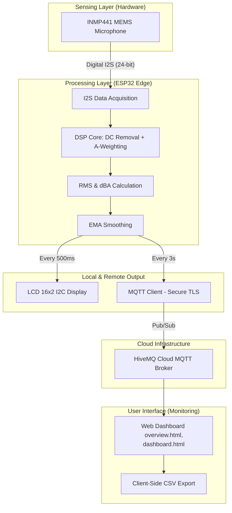
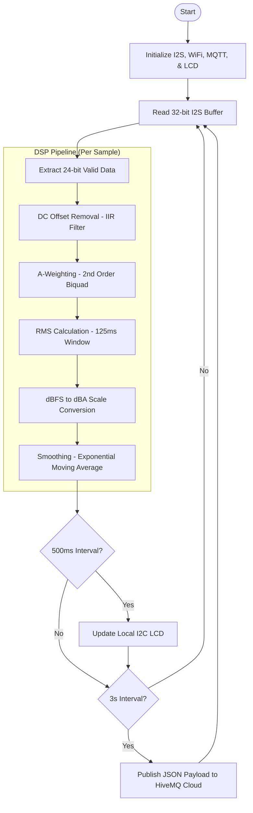

# AcousticLevel
**An IoT-Based Distributed Sound Pressure Level Monitoring System**
---

This project aims to address several challenges I found during my internship period at PT Angkasa Pura Indonesia (Injourney Airports). Currently, monitoring sound pressure levels at Juanda International Airport boarding gates requires manual, on-site device checks, which often fail to accurately reflect the noise perceived by visitors and passengers.
    
The quality and configuration of the Public Address (PA) system significantly influence sound and noise levels. Poor settings can lead to sound pollution, causing hearing damage, personal discomfort, and making announcements can hardly be heard or understood clearly.
    
To addres these issues, I developed a low-cost, functional IoT Sound Pressure Level Monitoring and data acquisition system. The   device I am developing here is based on the usage of [S8607 Sound Level Meter Product](https://tk.tokopedia.com/ZSxM6enKe/) here by the local technicians. The reading decibel-A data is also adapted from the device's specifications. Using the INMP441 MEMS I2S microphone and ESP32 microcontroller as the core hardware, the system connects to a web-based dashboard hosted on the Github Pages. This allows local technicians to remotely monitor devices in real time, eliminating the need for frequent physical site visits.


I will try to comprise everything in this following items:
- System Design/Architecture
- Firmware Logics/DSP Pipeline
- Pinout and Configuration
- Web-app dashboard
- MQTT Network Protocol 
- 3D print and Enclosure Box
- Bill of Materials (BOMs)

### System Architecture


This is the system architecture flowchart, covering end-to-end from sensor (sensing layer) and raw data acquisition to client-side, end-user web-app monitoring dashboard (application layer). The system works in this sequence of layers: Sensing, Processing, and Output.

---
**Layer Breakdown**
- Sensing Layer: INMP441 I2S Microphone: Responsible for capturing sound waves from the physical environment. It uses a pure I2S interface to ensure high-speed audio data acquisition without overloading the microcontroller's internal ADC.
- Processing Layer (ESP32): This layer utilizes the FPU (Floating Point Unit) available on the ESP32 for heavy mathematical calculations:
  - I2S Peripheral: Fetches raw 32-bit audio data (with 24-bit valid data) directly from the microphone.
  - DSP Core: The core of digital signal processing. It performs DC bias removal (eliminating signal offset), applies an A-Weighting filter (adjusting sensitivity to match human hearing), and calculates the RMS (Root Mean Square) value.
  - Logic: Converts the RMS value into calibrated decibels (SPL) and applies an EMA (Exponential Moving Average) to smooth out signal spikes, making the data more stable for reading.
- Output Layer:
  - Local Display: Displays the noise level (SPL) in real-time and independently on a 16x2 LCD screen at the hardware's location.
  - Remote Transmission (HiveMQ Cloud): Periodically sends telemetry data using the MQTT protocol (with built-in ACL for security) to the cloud.
  - Web App Dashboard: Runs entirely on the client-side (browser) without the need for an expensive backend server, fetching real-time data via WebSockets to be visualized for the end user.


``` So, in a nutshell: INMP441 captures the audio signal, raw 24-bit data via I2S protocol -> The ESP32 processes them -> The Network Layer transmits it via MQTT pub-sub -> The Web App visualizes the graphs and charts.```


###  Pinout Configuration
<p align="center">
    
    <br>
    <em>Pinout Configuration with ESP32 DevKit V1 board</em>
    <br>
    <em>source: https://cirkitdesigner.com/</em>
</p>

The system operates in **I2S Standard Mode (Philips)**, allowing for a direct 24-bit digital stream from the MEMS sensor to the ESP32's internal DMA buffer.

| INMP441 Pin | ESP32 Pin | Function | Description |
| :--- | :--- | :--- | :--- |
| **VDD** | 3V3 | Power | Power supply (1.62V - 3.63V) |
| **GND** | GND | Ground | Common system ground |
| **L/R** | GND | Channel Select | Pulled to GND for Left Channel acquisition |
| **WS** | GPIO 25 | Word Select | I2S Word/Slot select line |
| **SCK** | GPIO 26 | Bit Clock | I2S Serial Clock line |
| **SD** | GPIO 33 | Serial Data | I2S Digital Data output |
> **Note:** The **MCLK (Master Clock)** line is not required for this implementation, as the INMP441 generates its internal timing from the SCK line.

| LCD I2C Pin | ESP32 Pin | Function | Description |
| :--- | :--- | :--- | :--- |
| **VDD** | VIN | Power | Recommended power supply 5V |
| **GND** | GND | Ground | Common Ground  |
| **SDA** | GPIO 21 | Serial Data | I2C Serial Data Line |
| **SCL** | GPIO 22 | Serial Clock |  I2C Serial CLock Line |
> **Note:** The **LCD 16x2 I2C** usually requires stable 5V power supply for best contrast, while INMP441 must use 3.3v according to the datasheet.


### Firmware Logics/DSP Pipeline

The firmware is designed around a highly efficient, non-blocking execution loop. It processes high-frequency audio data on the fly while seamlessly handling local display updates and cloud telemetry without missing a single audio sample.

---
**Pipeline Breakdown**

* Data Extraction: The INMP441 microphone transmits 32-bit packets, but only 24 bits contain valid audio data. The system utilizes bit-shifting to precisely extract the 24-bit payload before routing it to the DSP core.
* DSP Core (Per Sample Processing):
  * DC Offset Removal (IIR Filter): Eliminates hardware-induced DC bias, ensuring the audio waveform is perfectly centered at zero.
  * A-Weighting (2nd Order Biquad): Applies a mathematical filter curve that mimics the frequency response of the human ear (dampening extreme highs/lows and emphasizing vocal ranges).
  * RMS Calculation: Computes the Root Mean Square over a precise 125ms window, which corresponds to the standard "Fast" response time used in professional SPL meters.
  * dBFS to dBA Conversion: Translates the internal digital dBFS (Decibels relative to full scale) into real-world analog Sound Pressure Level (dBA) using a calibrated offset.
  * EMA Smoothing: Applies an Exponential Moving Average filter to the final calculated dBA. This stabilizes the reading and prevents rapid flickering on the user interface.
* Asynchronous Output Logic: Instead of halting the audio processing to wait for network/display operations, the system uses non-blocking interval checks:
   * Local UI (500ms): The LCD updates twice a second, providing a highly responsive experience for local monitoring.
   * Cloud Telemetry (3s): Data is formatted into a JSON payload and published to the HiveMQ broker every 3 seconds. This significantly saves network bandwidth and cloud quotas without dropping the I2S audio stream.

